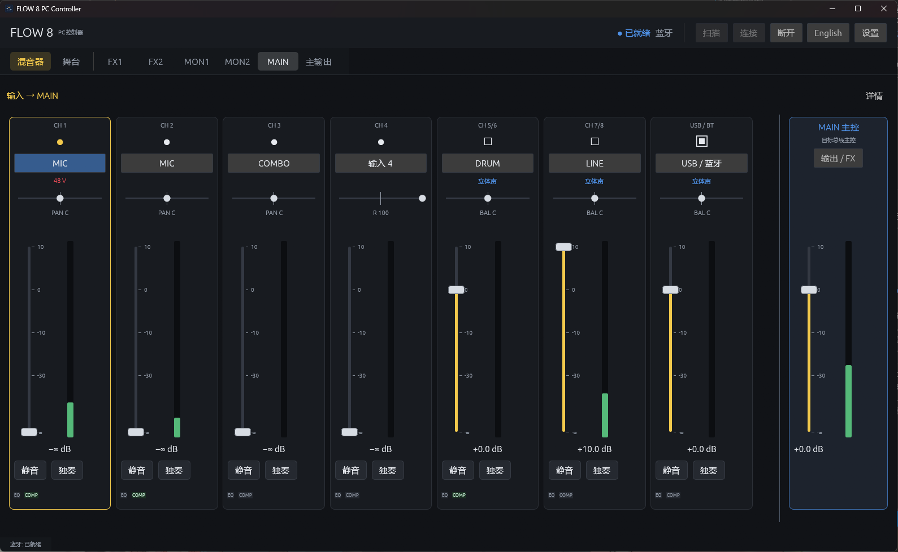
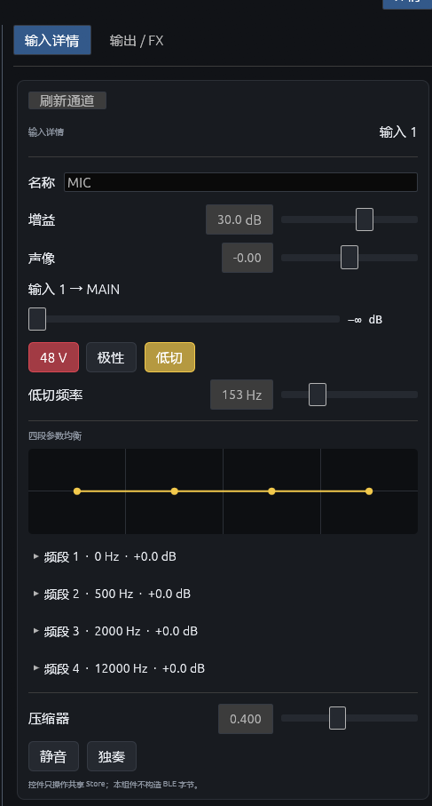
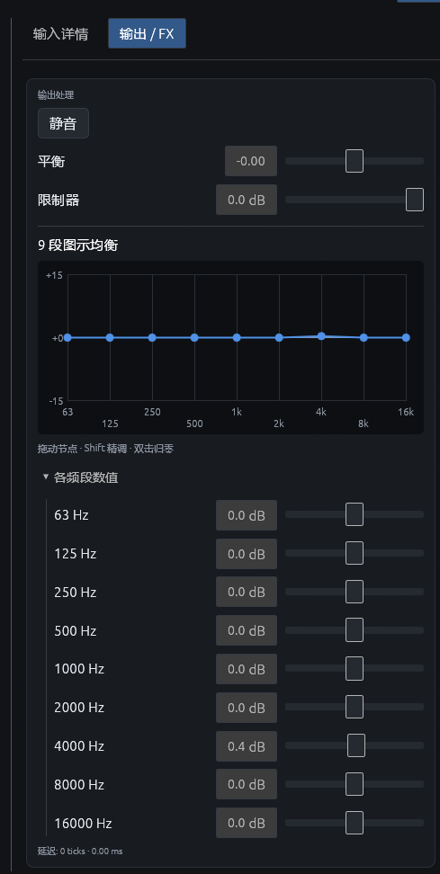
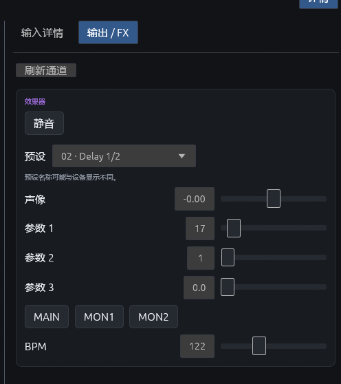
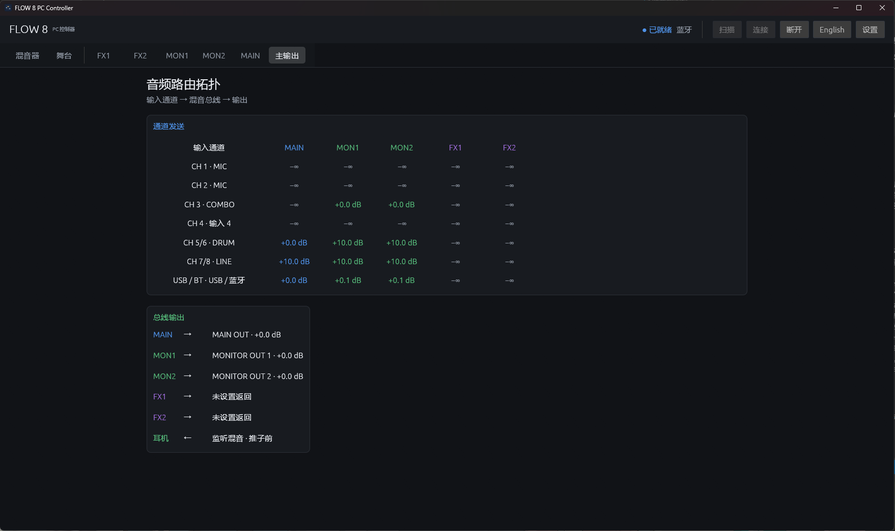
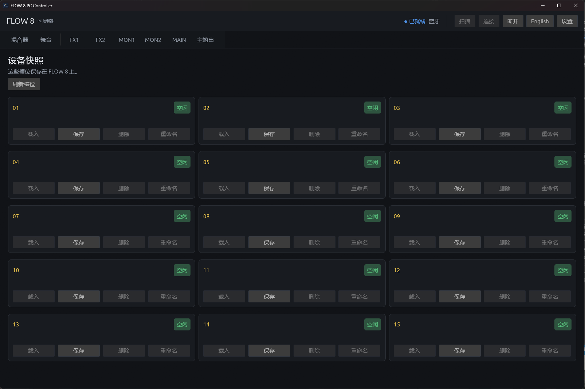

# FLOW 8 PC Controller

[English](README.md)

一款面向 Behringer FLOW 8 数字调音台的非官方原生 BLE 桌面客户端。它通过蓝牙低功耗连接，直接使用 FLOW 8 协议同步调音台状态并发送控制命令，**不通过 USB MIDI 控制调音台**。

本项目与 Behringer、Music Tribe 无关联。

## 界面截图

| 输入通道 | 输出详情 | 效果器设置 |
| :---: | :---: | :---: |
|  |  |  |

| 路由 | 设备快照 |
| :---: | :---: |
|  |  |

## 主要功能

- 原生 BLE 连接与握手、完整混音状态同步、实时设备通知。
- MAIN、MON1/2、FX1/2 混音层，以及输入编辑、路由、舞台视图和设备快照。
- 英文和简体中文界面。未连接时仍可查看界面；状态同步进入 Ready 后才能操作设备。
- Windows 通过单独安装的 [DirectHCI](https://github.com/NanamiKite/DirectHCI) 使用蓝牙；Linux 使用 BlueZ／btleplug 系统蓝牙栈。

各项功能的实机验收记录与待校准范围见[验证说明](docs/validation.md)；界面中有对应控件，不代表所有操作都已完成真机验收。

## 下载与安装

从本仓库的 [Releases](../../releases) 下载 Windows x64 安装包。FLOW 8 安装包**只包含图形程序**，不包含 DirectHCI 或蓝牙驱动。Windows 用户还须单独安装、准备 DirectHCI；详见 [安装说明](docs/installation.md)。实际控制器兼容性取决于 DirectHCI 与所用电脑。

## 快速开始

1. Windows：在 DirectHCI Control Panel 中启动服务，并准备、选择受支持的蓝牙控制器。Linux：确保系统蓝牙服务可用。
2. 启动 FLOW 8 PC Controller。Windows 当前的 DirectHCI 控制器获取路径需要**以管理员身份运行**。首次使用新的客户端身份时，在调音台上启用 **PAIR REMOTE / PAIR APP**。
3. 直接点击 **连接**。程序会在连接过程中自动扫描 `FLOW 8 LE`；如果只想先查看附近设备，可以单独点击 **扫描**。看到 **已就绪（Ready）** 后再操作混音控制。

首次连接会在用户配置目录创建可复用的客户端身份，不要随意删除。各页面、快照、断开重连和常见问题见[用户指南](docs/user-guide.zh-CN.md)。

## 架构与开发

Rust 图形界面向统一 Store 和会话运行时发送语义操作；公共 FLOW 编解码器处理数据包，平台传输层只转发特征值。Windows 默认使用 DirectHCI SDK 与外部 `directhcid`，FLOW 8 PC Controller 不管理 Windows 驱动或 Raw HCI。参见[架构](docs/architecture.md)、[协议](docs/protocol.md)和[开发说明](docs/DEVELOPMENT.md)。

旧版 C++／Qt 实现在独立的 `c++` 分支；当前分支是 Rust 应用。

## 许可证

GPL-3.0-only，详见 [LICENSE.txt](LICENSE.txt)。DirectHCI 是独立项目，其发布与依赖许可声明以该项目为准。
